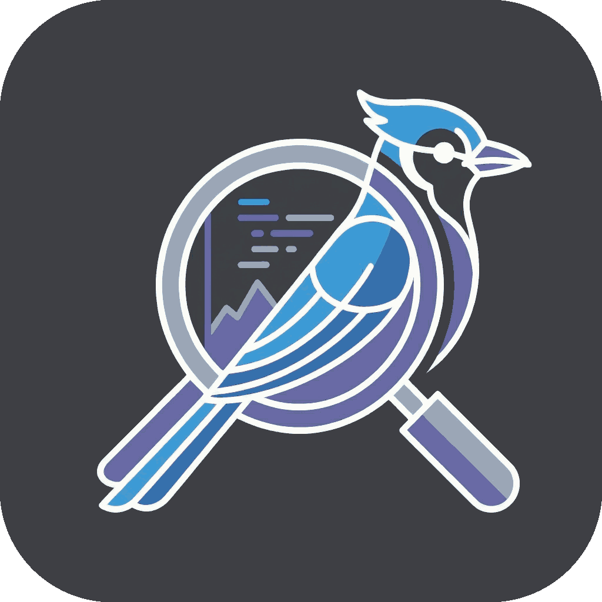

  

# JJ View

**JJ View** brings the power of [Jujutsu (jj)](https://github.com/martinvonz/jj) version control directly into VS Code. Visualize your revision graph, manage changes, and streamline your workflow without leaving the editor.

## Features

### 🌲 Interactive Revision Graph
Visualize your `jj` repo history with a clear, interactive graph.
- **View History**: See commits, branches, and the working copy in a topological view.
- **Inspect Changes**: Click on any node to view details and diffs.
- **Context Actions**: Right-click nodes to perform actions like editing, squashing, or abandoning changes.
- **Drag & Drop Workflows**:
  - **Rebase Source**: Drag a commit onto another to rebase it (and its children) onto the target.
  - **Rebase Revision**: Hold `Ctrl` (or `⌘` on macOS) while dragging to rebase only the specific revision.
  - **Move Bookmarks**: Drag bookmark pills from one commit to another to move them.
- **Selection**:
  - **Multi-Select**: `Ctrl+Click` (or `⌘+Click`) to select multiple commits.
  - **Contextual Commands**: Perform bulk actions like "Abandon" on all selected commits.
  - **Clear**: Press `Escape` to clear the selection.

### 📝 Commit Details Panel
A dedicated view for inspecting and managing commits.
- **Edit Descriptions**: Easily update commit messages.
- **File Differences**: View list of changed files and open diffs side-by-side.
- **Navigation**: Click changes to look at them in standard VS Code diff editors.

### 🛠️ Source Control Integration
Full integration with VS Code's Source Control view (SCM).
- **Working Copy**: View modified files, stage changes (via `jj` commit/squash workflows), and restore files.
- **Commit Management**: Create new changes, set descriptions, and squash changes directly from the SCM panel.
- **Merge Conflicts**: Identify and resolve conflicts using VS Code's merge editor.
- **File Decorations**: Automatically highlights modified, added, and conflicted files in the Explorer with color-coded badges.

*Source Control view managing `jj` changes.*

### 🚀 Efficient Workflows
Support for common and advanced `jj` operations:
- **Navigation**: Move to parent or child revisions easily.
- **Undo**: Quickly undo `jj` operations.
- **Squashing**: Squash changes into the parent revision.
- **Rebasing**: Rebase changes onto other revisions.

## Commands

Access these commands from the Command Palette (`Ctrl+Shift+P` or `⌘+Shift+P`) or context menus.

### General
- `JJ View: Refresh`: Refresh the current status and log.
- `JJ View: Undo`: Undo the last `jj` operation.

### Change Management
- `JJ View: New Change`: Create a new empty change at the current head.
- `JJ View: Edit`: Edit a specific revision.
- `JJ View: Duplicate`: Duplicate a change.
- `JJ View: Abandon`: Abandon (delete) a change.
- `JJ View: Restore`: Restore files in the working copy.
- `JJ View: Set Description`: Edit the description of the current change.
- `JJ View: Open File`: Open the file associated with a change.

### History & Merging
- `JJ View: Squash into Parent`: Squash the current change into its parent.
- `JJ View: Complete Squash`: Finish a squash operation (e.g., from the editor title).
- `JJ View: New Merge Change`: Create a merge commit.
- `JJ View: Open Merge Editor`: Open the merge editor for conflicted files.
- `JJ View: Rebase onto Selected`: Rebase the current change onto a selected target.

### Navigation
- `JJ View: Move to Child`: Move the working copy to a child revision.
- `JJ View: Move to Parent (Diff)`: Navigate to the parent revision while viewing a diff.
- `JJ View: Move to Child (Diff)`: Navigate to the child revision while viewing a diff.

## Extension Settings

Customize **JJ View** behavior in VS Code settings.

| Setting | Default | Description |
| :--- | :--- | :--- |
| `jj-view.refreshDebounceMillis` | `100` | Base debounce time (ms) for SCM refresh based on file events. |
| `jj-view.refreshDebounceMaxMultiplier` | `4` | Maximum multiplier for the debounce timeout when events continue to occur. |
| `jj-view.watcherIgnore` | `["node_modules", ".git"]` | Paths to ignore in the file watcher to prevent unnecessary refreshes. |

## Requirements

- **Jujutsu (jj)**: The `jj` CLI must be installed and available in your system `PATH`.
  - [Installation Guide](https://docs.jj-vcs.dev/latest/install-and-setup)

## Contributing

See [`CONTRIBUTING.md`](CONTRIBUTING.md) for details.

## License

Apache 2.0; see [`LICENSE`](LICENSE) for details.

## Disclaimer

This project is not an official Google project. It is not supported by Google and Google specifically disclaims all warranties as to its quality, merchantability, or fitness for a particular purpose.
