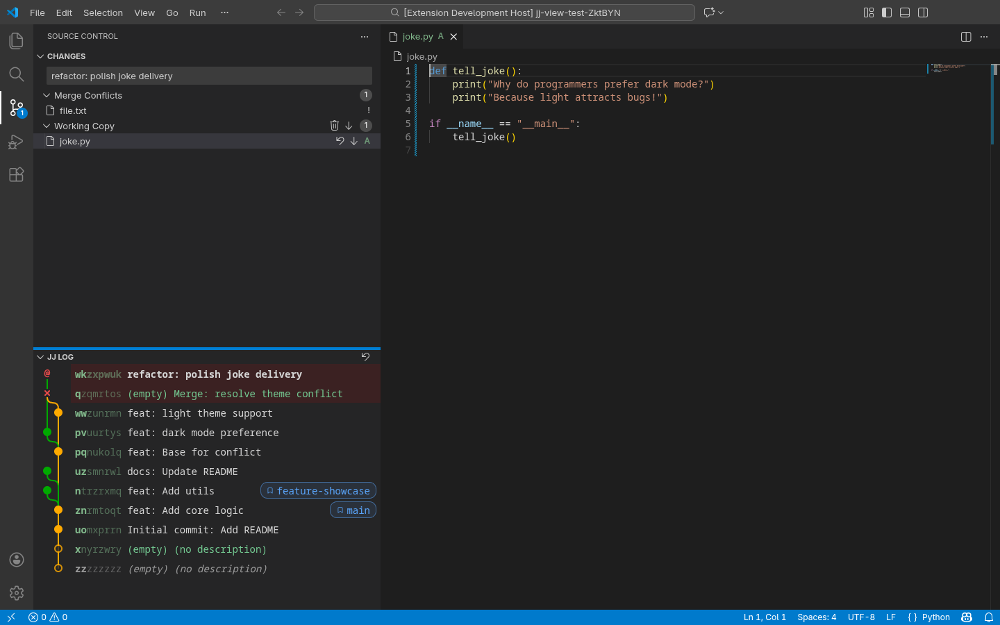

# JJ View

**JJ View** brings the power of [Jujutsu (jj)](https://github.com/martinvonz/jj) version control directly into VS Code. Visualize your revision graph, manage changes, and streamline your workflow without leaving the editor.

## Features

### 🌲 Interactive Revision Graph
Visualize your `jj` repo history with a clear, interactive graph.
- **View History**: See commits, branches, and the working copy in a topological view.
- **Inspect Changes**: Click on any node to view details and diffs.
- **Context Actions**: Right-click nodes to perform actions like editing, squashing, or abandoning changes.
- **Drag & Drop Workflows**:
  - **Rebase Source**: Drag a commit onto another to rebase it (and its children) onto the target.
  - **Rebase Revision**: Hold `Ctrl` (or `⌘` on macOS) while dragging to rebase only the specific revision.
  - **Move Bookmarks**: Drag bookmark pills from one commit to another to move them.
- **Selection**:
  - **Multi-Select**: `Ctrl+Click` (or `⌘+Click`) to select multiple commits.
  - **Contextual Commands**: Perform bulk actions like "Abandon" on all selected commits.
  - **Clear**: Press `Escape` to clear the selection.


### 📝 Commit Details Panel
A dedicated view for inspecting and managing commits.
- **Edit Descriptions**: Easily update commit messages.
- **Diff Management**:
  - **Open Multi-File Diff**: View all changes in the revision in a single scrollable editor.
  - **Single-File Diff**: Click any file to open a side-by-side diff.
  - **Editable Diffs**: For mutable commits, diff editors are fully editable. Save changes (`Ctrl+S`) to apply them back to the commit.
- **Navigation**: Quickly jump between changed files.

### 🛠️ Source Control Integration
Full integration with VS Code's Source Control view (SCM).
- **Working Copy**: View modified files, stage changes (via `jj` commit/squash workflows), and restore files.
- **Commit Management**: Create new changes, set descriptions, and squash changes directly from the SCM panel.
- **Merge Conflicts**: Identify and resolve conflicts using VS Code's merge editor.
- **File Decorations**: Automatically highlights modified, added, and conflicted files in the Explorer with color-coded badges.


*Source Control view managing `jj` changes.*

### 🚀 Efficient Workflows
Support for common and advanced `jj` operations:
- **Navigation**: Move to parent or child revisions easily.
- **Undo**: Quickly undo `jj` operations.
- **Squashing**: Squash changes into the parent revision.
- **Absorbing**: Automatically move changes into the mutable ancestor where they were introduced.
- **Rebasing**: Rebase changes onto other revisions.
- **Editable Diffs**: Edit any mutable commit directly in the diff editor. Changes are batched and applied on save, with full support for single and multi-file diffs.

## Commands

Access these commands from the Command Palette (`Ctrl+Shift+P` or `⌘+Shift+P`) or context menus.

### General
- `JJ View: Refresh`: Refresh the current status and log.
- `JJ View: Show Current Change`: Focus the graph on the current working copy change.
- `JJ View: Show Details`: Open a dedicated panel with full details of the selected commit.
- `JJ View: Undo`: Undo the last `jj` operation.

### Change Management
- `JJ View: New Change`: Create a new empty change at the current head.
- `JJ View: New Before`: Create a new change *before* the current revisions (inserts a new parent).
- `JJ View: Edit`: Edit a specific revision.
- `JJ View: Duplicate`: Duplicate a change.
- `JJ View: Abandon`: Abandon (delete) a change.
- `JJ View: Restore`: Restore files in the working copy.
- `JJ View: Set Description`: Edit the description of the current change.
- `JJ View: Upload`: Upload the current change (runs configured upload command).
- `JJ View: Set Bookmark`: Create or move a bookmark to a specific revision.
- `JJ View: Commit`: Commit the current changes in the working copy (Ctrl+Enter in SCM input).
- `JJ View: Commit (Prompt)`: Commit the current changes in the working copy, prompting for a description message first.
- `JJ View: Open File`: Open the file associated with a change.
- `JJ View: Show Multi-File Diff`: Open a comprehensive multi-file diff view for the selected revision. These views are editable for mutable commits.

### History & Merging
- `JJ View: Squash into Parent`: Squash the current change into its parent.
- `JJ View: Absorb`: Move changes into the mutable ancestor where they belong.
- `JJ View: Complete Squash`: Finish a squash operation (e.g., from the editor title).
- `JJ View: New Merge Change`: Create a merge commit.
- `JJ View: Open Merge Editor`: Open the merge editor for conflicted files.
- `JJ View: Rebase onto Selected`: Rebase the current change onto a selected target.

### Navigation
- `JJ View: Move to Child`: Move the working copy to a child revision.
- `JJ View: Move to Parent (Diff)`: Navigate to the parent revision while viewing a diff.
- `JJ View: Move to Child (Diff)`: Navigate to the child revision while viewing a diff.

## Features & Integration

### ⌨️ Keybindings
- **Commit**: `Ctrl+Enter` (or `Cmd+Enter` on macOS) in the SCM input box to commit changes.
- **Set Description**: `Ctrl+S` (or `Cmd+S` on macOS) in the SCM input box or Commit Details panel to save the description without finishing the commit.

### 🔄 Automatic Refresh
The extension automatically refreshes the view when:
- File changes are detected in the workspace.
- `jj` operations are performed via the CLI (external changes are polled).
- You switch focus back to the VS Code window.

### 🤖 Gerrit Integration
If you use Gerrit, **JJ View** provides enhanced integration:
- Shows the current **Gerrit Status** (e.g., Active, Merged) and provides a link to the CL.
- Configuration: Set `jj-view.gerrit.host` and `jj-view.gerrit.project` if they aren't automatically detected.

## Extension Settings

Customize **JJ View** behavior in VS Code settings.

| Setting | Default | Description |
| :--- | :--- | :--- |
| `jj-view.refreshDebounceMillis` | `100` | Base debounce time (ms) for SCM refresh based on file events. |
| `jj-view.refreshDebounceMaxMultiplier` | `4` | Maximum multiplier for the debounce timeout when events continue to occur. |
| `jj-view.fileWatcherMode` | `"polling"` | Controls how the extension detects external file changes. `"polling"` uses periodic status checks. `"watch"` uses a native file watcher ([parcel-watcher](https://github.com/parcel-bundler/watcher)) for more efficient, event-driven updates. Falls back to polling if the watcher fails to start. |
| `jj-view.gerrit.host` | `null` | Gerrit host URL (e.g., https://experiment-review.googlesource.com). If not set, extension attempts to detect it from .gitreview or git remotes. |
| `jj-view.gerrit.project` | `null` | Gerrit project name. If not set, extension attempts to detect it from git remotes. |
| `jj-view.uploadCommand` | `null` | Custom command to run for upload. Example: 'git push'. The command will be prefixed with 'jj' and suffixed with '-r <revision>'. |

## File Watcher Mode

The `"watch"` mode uses [parcel-watcher](https://github.com/parcel-bundler/watcher) for native, event-driven file change detection instead of periodic polling. This is more efficient for large repos, but may require additional setup depending on your platform.

**Linux — Increasing inotify watch limits**

The default `inotify` backend on Linux is limited by the system's max watch count. If you hit the limit, increase it:

```bash
# Check the current limit
cat /proc/sys/fs/inotify/max_user_watches

# Increase temporarily (resets on reboot)
sudo sysctl fs.inotify.max_user_watches=524288

# Increase permanently
echo 'fs.inotify.max_user_watches=524288' | sudo tee -a /etc/sysctl.conf
sudo sysctl -p
```

**Linux & Windows — Using Watchman (recommended)**

On non-macOS platforms, we recommend installing [Watchman](https://facebook.github.io/watchman/) for a more robust and scalable file watching backend. When Watchman is installed and available on your `PATH`, parcel-watcher will automatically use it instead of `inotify` (Linux) or the default Windows backend. Watchman handles large repositories more gracefully and avoids inotify watch limit issues entirely.

- [Watchman Installation Guide](https://facebook.github.io/watchman/docs/install)

## Requirements

- **Jujutsu (jj)**: The `jj` CLI must be installed and available in your system `PATH`.
  - [Installation Guide](https://docs.jj-vcs.dev/latest/install-and-setup)

## Contributing

See [`CONTRIBUTING.md`](CONTRIBUTING.md) for details.

## License

Apache 2.0; see [`LICENSE`](LICENSE) for details.

## Disclaimer

This project is not an official Google project. It is not supported by Google and Google specifically disclaims all warranties as to its quality, merchantability, or fitness for a particular purpose.
