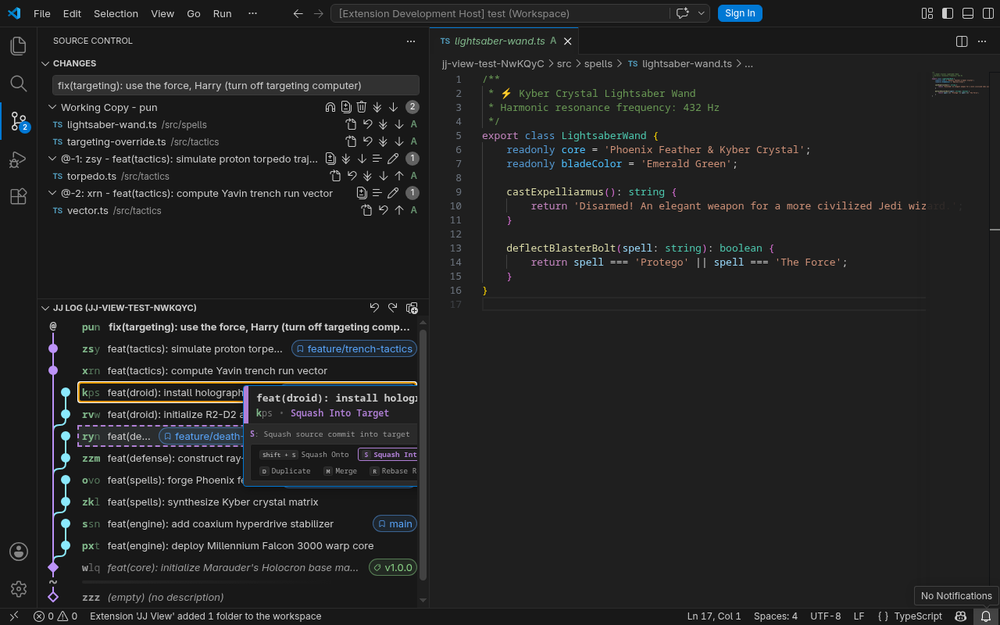
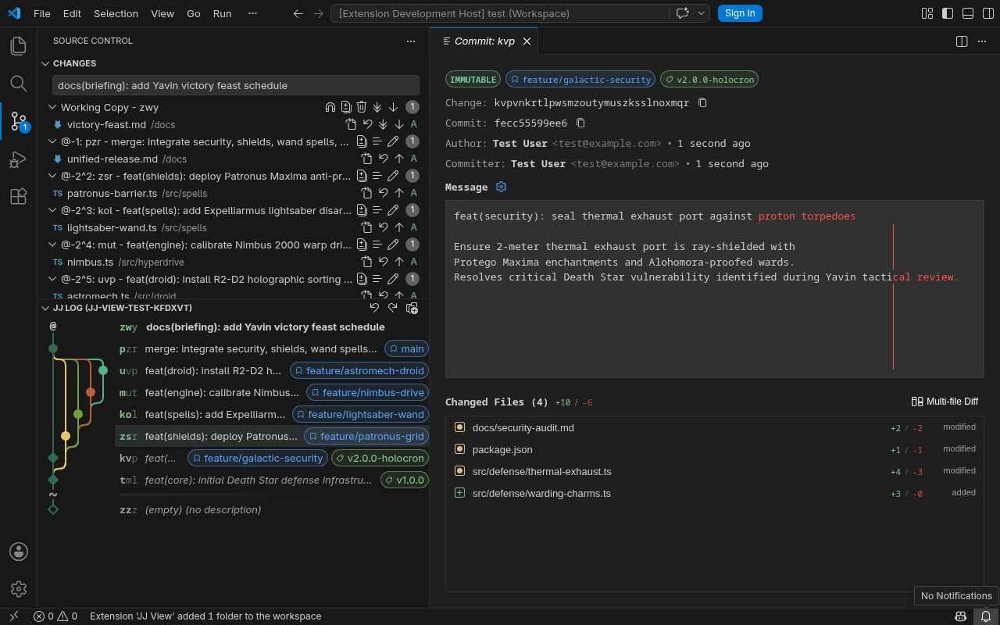
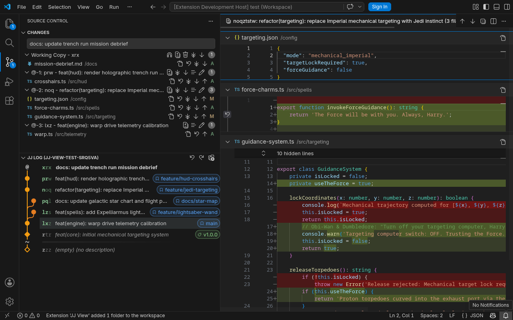

# JJ View

**JJ View** brings the power of [Jujutsu (jj)](https://github.com/martinvonz/jj) version control directly into VS Code. Visualize your revision graph, manage changes, and streamline your workflow without leaving the editor.


_JJ View Source Control & Interactive Revision Graph in VS Code (Theme: Default)._

## Features

### 🌲 Interactive Revision Graph

Visualize your `jj` repo history with a clear, interactive graph.

- **View History**: See commits, branches, and the working copy in a topological view.
- **Inspect Changes**: Click on any node to view details and diffs.
- **Context Actions**: Right-click nodes to perform actions like editing, squashing, or abandoning changes.
- **Drag & Drop Workflows**:
    - **Rebase Branch (default)**: Drag a commit onto another to rebase the source commit and all of its descendants onto the target.
    - **Rebase Revision**: Press `R` while dragging to rebase only the specific revision.
    - **Squash Into**: Press `S` while dragging to squash the source commit into the target commit.
    - **Squash Onto**: Press `Shift+S` while dragging to create a new commit containing the source's changes on top of the target commit.
    - **Duplicate Onto**: Press `D` while dragging to duplicate the source commit on top of the target commit.
    - **Merge Revisions**: Press `M` while dragging to create a new revision that merges both commits (setting both the source and target commits as parents).
    - **Move Bookmarks**: Drag bookmark pills from one commit to another to move them.
- **Selection**:
    - **Multi-Select**: `Ctrl+Click` (or `⌘+Click`) to select multiple commits.
    - **Contextual Commands**: Perform bulk actions like "Abandon" on all selected commits.
    - **Clear**: Press `Escape` to clear the selection.
- **Ghost Nodes**: Displays visual representations of hidden commits in the graph.
- **Divergent Commits**: Highlights divergent revisions with distinct visual styling (e.g. purple highlights and change ID offsets like `/1`).
- **Multi-Workspace Support**: Displays workspace indicators (working copy pills) for all workspaces associated with a commit in the log view.
- **Customizable Graph Lanes**: Choose from multiple built-in color themes (`default`, `oceanic`, `sunset`, `neon`, `pastel`, `monochrome`, `nord`, `dracula`, `forest`, `solarized`, `autumn`, `matrix`) for log lanes.


_Interactive drag-and-drop revision management across parallel lanes with real-time modifier hints (Theme: Dracula)._

### 🛠️ Source Control Integration

Full integration with VS Code's Source Control view (SCM) and Jujutsu workflows:

- **Working Copy**: View modified files, stage modifications (via `jj` commit/squash workflows), and restore files.
- **Commit Management**: Create new changes (revisions), set descriptions, and squash modifications directly from the SCM panel.
- **Navigation & History**: Quickly switch focus between parent and child revisions, and undo or redo `jj` operations with a single click.
- **Squashing & Absorbing**: Squash whole revisions or individual files into parent or ancestor revisions, or automatically absorb changes into the mutable ancestor where they were introduced.
- **Merge Conflicts**: Identify and resolve conflicts using VS Code's merge editor.
- **File Decorations**: Automatically highlights modified, added, conflicted, and ignored files in the Explorer with color-coded badges.

### 📝 Commit Details Panel

A dedicated view for inspecting and managing commits.

- **Status Indicators**: View clear visual pills for commit properties like Immutable, Empty, Conflicted, Tags and Bookmarks.
- **Commit Info**: Displays Author, Committer, and Relative Timestamps. Includes a click-to-copy utility for Commit and Change IDs.
- **Format Body**: Automatically format the commit description body to the configured width with 50/72 character rulers.
- **Diff Management**:
    - **Open Multi-File Diff**: View all changes in the revision in a single scrollable editor.
    - **Single-File Diff**: Click any file to open a side-by-side diff.
    - **Editable Diffs**: For mutable commits, diff editors are fully editable. Save changes (`Ctrl+S`) to apply them back to the commit.
    - **Compare with Revision**: Compare the working copy or a specific file against any chosen ancestor revision.
- **Navigation**: Quickly jump between changed files.


_Dedicated `.jj-commit` editor with character rulers, status pills, and changed file list (Theme: Forest)._

### 🔍 Multi-File & Editable Diffs

Comprehensive diff viewing and editing for changesets across your repository:

- **Multi-File Diff Editor**: Review all file changes within a revision stacked in a single scrollable editor with collapsible diff blocks, line counts, and file badges.
- **Editable Diffs**: Edit any mutable commit directly inside the diff editor. Modifications across multiple files are batched and applied on save (`Ctrl+S`).
- **Arbitrary Revision Comparisons**: Compare the working copy or individual files against any ancestor revision or commit in your graph.


_Multi-File Diff editor reviewing changes across revisions (Theme: Autumn)._

### 🌐 Code Forge & Review Integrations

**JJ View** integrates with popular code forge providers to bring pull requests, merge requests, and code reviews directly into VS Code:

- **🤖 Gerrit Integration**: Displays current Gerrit status (e.g. Active, Merged) and provides direct links to CLs. Auto-detects from `.gitreview` or git remotes.
- **🐱 GitHub Integration**: Displays PR status (Open, Merged, Draft), checks mergeability, and tracks unresolved comment counts. Supports uploading changes via SCM actions.
- **🦊 GitLab Integration**: Displays Merge Request status, checks mergeability, and tracks unresolved comments for GitLab and self-hosted instances.
- **💬 Review Discussions & Inline Comments**:
    - **Unresolved Comments Bubble**: Displays a counter pill on each revision with pending unresolved comments.
    - **Inline Comment Threads**: View code review comments inline directly in the VS Code diff editors.
    - **Reply & Resolution Actions**: Quickly respond with `Ack`, `Done`, `Reply & Resolve`, or `Reply`.
    - **Copy Unresolved Comments**: Copies a formatted markdown summary of unresolved comments for the active revision to your clipboard.
- **🔑 Seamless Authentication**: Integrates with VS Code's built-in OAuth flows or Personal Access Tokens (PAT), prompting automatically when required and providing a **Manage Code Forge Authentication** menu in the SCM title bar.

### 🗂️ Multi-Repository & Workspace Management

Full support for working with multiple repositories and Jujutsu workspaces:

- **Automatic Repository Detection**: Recursively scans workspace folders to discover and register all `jj` repositories.
- **Automatic Active Repository Switching**: Dynamically switches the active repository when navigating files and tabs across different repos.
- **Manual Switching**: Focus specific repositories in the JJ Log view via SCM title actions or the `Show Repository in JJ Log` command.
- **Workspace Management**: Create new `jj` workspaces directly from the UI, with configurable default locations (`.workspaces`).
- **Workspace Actions**: Add, forget, or delete workspaces directly from the Log View context menu or workspace pills.

## Commands & Keybindings

### ⌨️ Keybindings

- **Commit**: `Ctrl+Enter` (or `Cmd+Enter` on macOS) in the SCM input box to commit changes.
- **Set Description**: `Ctrl+S` (or `Cmd+S` on macOS) in the SCM input box or Commit Details panel to save the description without finishing the commit.
- **Focus SCM Description Input**: `Ctrl+Shift+G` (or `Cmd+Shift+G` on macOS) to open Source Control and focus the description input field (overrides VS Code's default SCM view binding when `scmProvider == 'jj'`).

### 🔄 Automatic Refresh

The extension automatically refreshes the view when:

- File changes are detected in the workspace.
- `jj` operations are performed via the CLI (external changes are polled or event-driven).
- You switch focus back to the VS Code window.

### General Commands

- `JJ View: Refresh`: Refresh the current status and log.
- `JJ View: Show Current Change`: Focus the graph on the current working copy change.
- `JJ View: Show Details`: Open a dedicated panel with full details of the selected commit.
- `JJ View: Show Repository in JJ Log`: Focus the repository in the JJ Log view.
- `JJ View: Focus SCM Description Input`: Focus the description input field in the Source Control view.
- `JJ View: Undo`: Undo the last `jj` operation.
- `JJ View: Redo`: Redo the last undone `jj` operation.
- `JJ View: Manage Code Forge Authentication`: Manage authentication preferences for code forge integrations.

### Change Management Commands

- `JJ View: New`: Create a new empty change at the current head.
- `JJ View: New Before`: Create a new change _before_ the current revisions (inserts a new parent).
- `JJ View: New After`: Create a new change _after_ the current revisions (inserts a new child).
- `JJ View: Edit`: Edit a specific revision.
- `JJ View: Duplicate`: Duplicate a change.
- `JJ View: Abandon`: Abandon (delete) a change.
- `JJ View: Discard Change`: Discard all files within a change in the SCM view.
- `JJ View: Restore`: Restore files in the working copy.
- `JJ View: Set Description`: Edit the description of the current change.
- `JJ View: Set Description (Prompt)`: Edit the description of the current change using an interactive prompt.
- `JJ View: Upload`: Upload the current change (runs configured upload command).
- `JJ View: Upload Stack`: Upload the current stack of changes (chains PRs/MRs on GitHub/GitLab).
- `JJ View: Set Bookmark`: Create or move a bookmark to a specific revision.
- `JJ View: Delete Bookmark`: Delete a bookmark.
- `JJ View: Commit`: Commit the current changes in the working copy (Ctrl+Enter in SCM input).
- `JJ View: Commit (Prompt)`: Commit the current changes in the working copy, prompting for a description message first.
- `JJ View: Open File in Working Copy`: Open the file in the working copy.
- `JJ View: Open Changes`: Open the diff view for a file.
- `JJ View: Add Workspace`: Create a new `jj` workspace.
- `JJ View: Forget Workspace`: Forget a workspace without deleting its directory.
- `JJ View: Delete Workspace Directory`: Forget a workspace and delete its directory from disk.
- `JJ View: Show Multi-File Diff`: Open a comprehensive multi-file diff view for the selected revision. These views are editable for mutable commits.
- `JJ View: Compare All Files with Revision...`: Compare all files between a selected revision and the working copy.
- `JJ View: Compare File with Revision...`: Compare a specific file against a selected revision.

### History & Merging Commands

- `JJ View: Squash Revision into Parent`: Squash the current change into its parent.
- `JJ View: Squash Revision into Ancestor...`: Squash the current change into an ancestor.
- `JJ View: Absorb`: Move changes into the mutable ancestor where they belong.
- `JJ View: New Merge Change`: Create a merge commit.
- `JJ View: Rebase onto Selected`: Rebase the current change onto a selected target.

## Configuration

### Extension Settings

Customize **JJ View** behavior in VS Code settings.

| Setting                                | Default       | Description                                                                                                                                                                                                                                                                                          |
| :------------------------------------- | :------------ | :--------------------------------------------------------------------------------------------------------------------------------------------------------------------------------------------------------------------------------------------------------------------------------------------------- |
| `jj-view.refreshDebounceMillis`        | `100`         | Base debounce time (ms) for SCM refresh based on file events.                                                                                                                                                                                                                                        |
| `jj-view.readTimeoutSeconds`           | `120`         | Timeout in seconds for read operations executed by the jj service.                                                                                                                                                                                                                                   |
| `jj-view.showProcessMonitorPanel`      | `false`       | Controls whether the JJ Process Monitor diagnostic view is displayed in the bottom panel.                                                                                                                                                                                                            |
| `jj-view.refreshDebounceMaxMultiplier` | `4`           | Maximum multiplier for the debounce timeout when events continue to occur.                                                                                                                                                                                                                           |
| `jj-view.fileWatcherMode`              | `"polling"`   | Controls how the extension detects external file changes. `"polling"` uses periodic status checks. `"watch"` uses a native file watcher ([parcel-watcher](https://github.com/parcel-bundler/watcher)) for more efficient, event-driven updates. Falls back to polling if the watcher fails to start. |
| `jj-view.codeForge.provider`           | `null`        | Force the active Code Forge provider to a specific service. Options: `github`, `gitlab`, `gerrit`. If not set, it is auto-detected from git remotes. |
| `jj-view.gerrit.host`                  | `null`        | Gerrit host URL (e.g., https://gerrit-review.googlesource.com). If not set, extension attempts to detect it from .gitreview or git remotes.                                                                                                                                                      |
| `jj-view.gerrit.project`               | `null`        | Gerrit project name. If not set, extension attempts to detect it from git remotes.                                                                                                                                                                                                                   |
| `jj-view.gitlab.host`                  | `null`        | GitLab host URL (e.g., https://gitlab.com). If not set, extension attempts to detect it from git remotes.                                                                                                                                                                                            |
| `jj-view.alwaysUploadStack`            | `false`       | Always upload changes as stacked pull requests or merge requests. When enabled, the extra 'Upload Stack' context menu item is hidden and all upload actions upload the full stack.                                                                                                                |
| `jj-view.uploadCommand`                | `null`        | Custom command to run for upload. Example: 'git push'. The command will be prefixed with 'jj' and suffixed with '-r <revision>' or repeated '-r'/'-c' arguments for stacked uploads.                                                                                                                                                                     |
| `jj-view.minChangeIdLength`            | `1`           | Minimum number of characters to display for change IDs. This affects the unique prefix calculation and UI truncation.                                                                                                                                                                                |
| `jj-view.maxMutableAncestors`          | `10`          | Maximum number of mutable ancestors to display in the SCM view.                                                                                                                                                                                                                                      |
| `jj-view.logTheme`                     | `"default"`   | Color theme for the graph lanes in the JJ Log view. Available options: `default`, `oceanic`, `sunset`, `neon`, `pastel`, `monochrome`, `nord`, `dracula`, `forest`, `solarized`, `autumn`, `matrix`.                                                                                              |
| `jj-view.graphLabelAlignment`          | `"aligned"`   | Controls the horizontal alignment of commit messages in the log view. Available options: `aligned`, `compact`.                                                                                                                                                                                       |
| `jj-view.commit.titleWidthRuler`       | `50`          | Width at which to display a ruler in the commit details description editor for the title line.                                                                                                                                                                                                       |
| `jj-view.commit.bodyWidthRuler`        | `72`          | Width at which to display a ruler in the commit details description editor for the body.                                                                                                                                                                                                             |
| `jj-view.commit.formatDescriptionOnSave` | `false`       | Automatically format and wrap the commit description body when saving.                                                                                                                                                                                                                               |
| `jj-view.binaryPath`                   | `""`          | Optional absolute path to the 'jj' binary. If empty, the extension will search for it in your PATH.                                                                                                                                                                                                  |
| `jj-view.suppressGitColocationWarning` | `false`       | Suppress the warning to disable the built-in Git extension in colocated repositories.                                                                                                                                                                                                                |
| `jj-view.workspacesLocation`           | `.workspaces` | Directory where new workspaces are created. Relative paths are resolved against the main repository root.                                                                                                                                                                                            |
| `jj-view.openDiffOnClick`              | `true`        | Controls whether the diff editor should be opened when clicking a change. Otherwise the regular editor will be opened.                                                                                                                                                                                |
| `jj-view.autoRepositoryDetection`      | `true`        | Controls whether to automatically detect jj repositories. true: Scans workspace folders and all subfolders recursively; false: Only checks workspace roots; subFolders: Scans immediate subfolders; openEditors: Only registers on-demand when files are opened.                                    |
| `jj-view.scanRepositories`             | `[]`          | List of absolute or workspace-relative directory paths to explicitly scan for jj repositories.                                                                                                                                                                                                        |
| `jj-view.ignoredRepositories`          | `[]`          | List of absolute directory paths of jj repositories that should be explicitly ignored.                                                                                                                                                                                                                |

### Conditional `jj` Configuration

When `jj-view` executes `jj` commands, it sets the `JJ_VIEW_EXTENSION=1` environment variable. This allows you to configure conditional logic in your `.jjconfig.toml` file to apply specific settings only when interacting with the repository via the VS Code extension.

For example, you can configure a different default log revset for the extension:

```toml
[[--scope]]
--when.environments = ["JJ_VIEW_EXTENSION=1"]
[--scope.revsets]
log = "trunk().." # Or any other revset you prefer for the graph view
```

### File Watcher Mode

The `"watch"` mode uses [parcel-watcher](https://github.com/parcel-bundler/watcher) for native, event-driven file change detection instead of periodic polling. This is more efficient for large repos, but may require additional setup depending on your platform.

#### Linux — Increasing inotify watch limits

The default `inotify` backend on Linux is limited by the system's max watch count. If you hit the limit, increase it:

```bash
# Check the current limit
cat /proc/sys/fs/inotify/max_user_watches

# Increase temporarily (resets on reboot)
sudo sysctl fs.inotify.max_user_watches=524288

# Increase permanently
echo 'fs.inotify.max_user_watches=524288' | sudo tee -a /etc/sysctl.conf
sudo sysctl -p
```

#### Linux & Windows — Using Watchman (recommended)

On non-macOS platforms, we recommend installing [Watchman](https://facebook.github.io/watchman/) for a more robust and scalable file watching backend. (macOS uses the native `fs-events` backend by default). When Watchman is installed and available on your `PATH`, parcel-watcher will automatically use it instead of `inotify` (Linux) or the default Windows backend. Watchman handles large repositories more gracefully and avoids inotify watch limit issues entirely.

- [Watchman Installation Guide](https://facebook.github.io/watchman/docs/install)

##### Managing Watchman Retention (`idle_reap_age_seconds`)

By default, the Watchman daemon retains idle directory watches for **5 days** (`idle_reap_age_seconds: 432000`) before reaping them. A watch is considered idle only when no active subscriptions or clients are querying it; **open workspaces in VS Code will never be reaped while in use**. However, once you close a workspace or exit VS Code, lingering watches remain registered with the daemon and continue to consume system inotify resources on Linux.

To prevent watches from accumulating when you work across multiple repositories or ephemeral workspaces, we recommend setting `idle_reap_age_seconds` to **1 hour** (`3600` seconds):

- **Per-repository**: Add a `.watchmanconfig` file in your repository root:
  ```json
  {
      "idle_reap_age_seconds": 3600
  }
  ```

- **Globally across all repositories**:
  - **Linux / macOS (System-wide, recommended)** in `/etc/watchman.json`:
    ```json
    {
        "idle_reap_age_seconds": 3600
    }
    ```
  - **Windows (System-wide)** in `%ALLUSERSPROFILE%\watchman.json` (typically `C:\ProgramData\watchman.json`):
    ```json
    {
        "idle_reap_age_seconds": 3600
    }
    ```
  - **Per-user** by pointing `WATCHMAN_CONFIG_FILE` to a custom file (e.g., `~/.config/watchman.json`):
    - **Bash/Zsh** (`~/.bashrc` / `~/.zshrc`):
      ```bash
      export WATCHMAN_CONFIG_FILE="$HOME/.config/watchman.json"
      ```
    - **Fish** (`~/.config/fish/conf.d/watchman.fish`):
      ```fish
      set -gx WATCHMAN_CONFIG_FILE "$HOME/.config/watchman.json"
      ```
    - **systemd user environments** (`~/.config/environment.d/watchman.conf`):
      ```ini
      WATCHMAN_CONFIG_FILE=%h/.config/watchman.json
      ```
    - **Windows (PowerShell)**:
      ```powershell
      [System.Environment]::SetEnvironmentVariable('WATCHMAN_CONFIG_FILE', "$HOME\.config\watchman.json", 'User')
      ```

> [!NOTE]
> Changes to global configuration files or `WATCHMAN_CONFIG_FILE` require restarting the daemon to take effect:
> ```bash
> watchman shutdown-server
> ```

##### Useful Watchman Commands

- **List active watches**: `watchman watch-list`
- **Delete a specific watch**: `watchman watch-del <path>`
- **Delete all active watches**: `watchman watch-del-all`
- **Restart the daemon**: `watchman shutdown-server`

## Requirements

- **Jujutsu (jj)**: The `jj` CLI must be installed. By default, it must be available in your system `PATH`, but you can also configure a custom path in the extension settings.
    - [Installation Guide](https://docs.jj-vcs.dev/latest/install-and-setup)

## Contributing

See [`CONTRIBUTING.md`](CONTRIBUTING.md) for details.

## License

Apache 2.0; see [`LICENSE`](LICENSE) for details.

## Disclaimer

This project is not an official Google project. It is not supported by Google and Google specifically disclaims all warranties as to its quality, merchantability, or fitness for a particular purpose.
