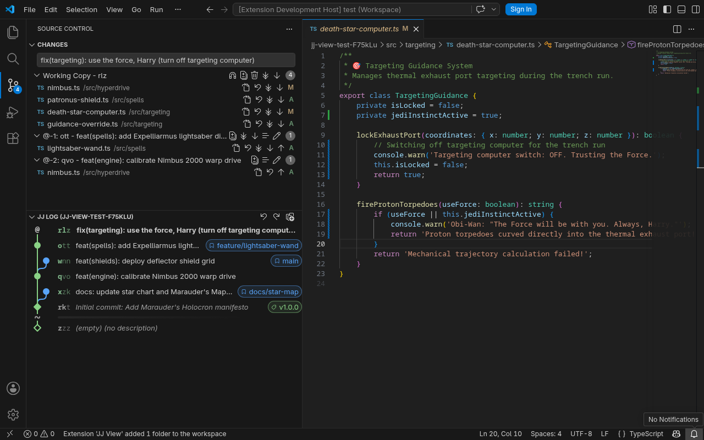

# JJ View

**JJ View** brings the power of [Jujutsu (jj)](https://github.com/martinvonz/jj) version control directly into VS Code. Visualize your revision graph, manage changes, and streamline your workflow without leaving the editor.

## Features

### 🌲 Interactive Revision Graph

Visualize your `jj` repo history with a clear, interactive graph.

- **View History**: See commits, branches, and the working copy in a topological view.
- **Inspect Changes**: Click on any node to view details and diffs.
- **Context Actions**: Right-click nodes to perform actions like editing, squashing, or abandoning changes.
- **Drag & Drop Workflows**:
    - **Rebase Source**: Drag a commit onto another to rebase it (and its children) onto the target.
    - **Rebase Revision**: Hold `Ctrl` (or `⌘` on macOS) while dragging to rebase only the specific revision.
    - **Move Bookmarks**: Drag bookmark pills from one commit to another to move them.
- **Selection**:
    - **Multi-Select**: `Ctrl+Click` (or `⌘+Click`) to select multiple commits.
    - **Contextual Commands**: Perform bulk actions like "Abandon" on all selected commits.
    - **Clear**: Press `Escape` to clear the selection.
- **Ghost Nodes**: Displays visual representations of hidden commits in the graph.
- **Divergent Commits**: Highlights divergent revisions with distinct visual styling (e.g. purple highlights and change ID offsets like `/1`).
- **Multi-Workspace Support**: Displays workspace indicators (working copy pills) for all workspaces associated with a commit in the log view.
- **Customizable Graph Lanes**: Choose from multiple built-in color themes (Oceanic, Sunset, Neon, Pastel, Monochrome) for log lanes.

### 📝 Commit Details Panel

A dedicated view for inspecting and managing commits.

- **Status Indicators**: View clear visual pills for commit properties like Immutable, Empty, Conflicted, Tags and Bookmarks.
- **Commit Info**: Displays Author, Committer, and Relative Timestamps. Includes a click-to-copy utility for Commit and Change IDs.
- **Format Body**: Automatically format the commit description body to the configured width.
- **Diff Management**:
    - **Open Multi-File Diff**: View all changes in the revision in a single scrollable editor.
    - **Single-File Diff**: Click any file to open a side-by-side diff.
    - **Editable Diffs**: For mutable commits, diff editors are fully editable. Save changes (`Ctrl+S`) to apply them back to the commit.
    - **Compare with Revision**: Compare the working copy or a specific file against any chosen ancestor revision.
- **Navigation**: Quickly jump between changed files.

### 🛠️ Source Control Integration

Full integration with VS Code's Source Control view (SCM).

- **Working Copy**: View modified files, stage modifications (via `jj` commit/squash workflows), and restore files.
- **Commit Management**: Create new changes (revisions), set descriptions, and squash modifications directly from the SCM panel.
- **Merge Conflicts**: Identify and resolve conflicts using VS Code's merge editor.
- **File Decorations**: Automatically highlights modified, added, conflicted, and ignored files in the Explorer with color-coded badges.
- **Code Forge Integration**: Track pull request (GitHub), merge request (GitLab), and change list (Gerrit) review status directly in the Source Control view, with contextual upload actions that visually indicate if a change is dirty (needs to be uploaded).


_Source Control view managing `jj` changes._

### 🚀 Efficient Workflows

Support for common and advanced `jj` operations:

- **Navigation**: Quickly switch focus between parent and child revisions.
- **Undo/Redo**: Quickly undo or redo `jj` operations.
- **Squashing**: Squash whole revisions or individual files into parent or child revisions.
- **Absorbing**: Automatically move changes into the mutable ancestor where they were introduced.
- **Rebasing**: Rebase changes onto other revisions.
- **Workspace Management**: Create new `jj` workspaces directly from the UI, with configurable default locations.
- **Workspace Actions**: Add, forget, or delete workspaces directly from the Log View context menu or workspace pills.
- **Editable Diffs**: Edit any mutable commit directly in the diff editor. Changes are batched and applied on save, with full support for single and multi-file diffs.

### 🗂️ Multi-Repository Support

Full support for working with multiple `jj` repositories in the same workspace.

- **Automatic Repository Detection**: Recursively scans workspace folders to discover and register all `jj` repositories.
- **Automatic Active Repository Switching**: Dynamically switches the active/focused repository when switching between editor tabs or files belonging to different repositories.
- **Manual Switching**: Focus specific repositories in the JJ Log view via SCM title actions or the `Show Repository in JJ Log` command.
- **Customizable Detection**: Fine-tune detection with settings to ignore specific folders or target explicit paths.

## Commands

Access these commands from the Command Palette (`Ctrl+Shift+P` or `⌘+Shift+P`) or context menus.

### General

- `JJ View: Refresh`: Refresh the current status and log.
- `JJ View: Show Current Change`: Focus the graph on the current working copy change.
- `JJ View: Show Details`: Open a dedicated panel with full details of the selected commit.
- `JJ View: Show Repository in JJ Log`: Focus the repository in the JJ Log view.
- `JJ View: Focus SCM Description Input`: Focus the description input field in the Source Control view.
- `JJ View: Undo`: Undo the last `jj` operation.
- `JJ View: Redo`: Redo the last undone `jj` operation.
- `JJ View: Manage Code Forge Authentication`: Manage authentication preferences for code forge integrations.

### Change Management

- `JJ View: New`: Create a new empty change at the current head.
- `JJ View: New Before`: Create a new change _before_ the current revisions (inserts a new parent).
- `JJ View: New After`: Create a new change _after_ the current revisions (inserts a new child).
- `JJ View: Edit`: Edit a specific revision.
- `JJ View: Duplicate`: Duplicate a change.
- `JJ View: Abandon`: Abandon (delete) a change.
- `JJ View: Discard Change`: Discard all files within a change in the SCM view.
- `JJ View: Restore`: Restore files in the working copy.
- `JJ View: Set Description`: Edit the description of the current change.
- `JJ View: Set Description (Prompt)`: Edit the description of the current change using an interactive prompt.
- `JJ View: Upload`: Upload the current change (runs configured upload command).
- `JJ View: Set Bookmark`: Create or move a bookmark to a specific revision.
- `JJ View: Delete Bookmark`: Delete a bookmark.
- `JJ View: Commit`: Commit the current changes in the working copy (Ctrl+Enter in SCM input).
- `JJ View: Commit (Prompt)`: Commit the current changes in the working copy, prompting for a description message first.
- `JJ View: Open File in Working Copy`: Open the file in the working copy.
- `JJ View: Open Changes`: Open the diff view for a file.
- `JJ View: Add Workspace`: Create a new `jj` workspace.
- `JJ View: Forget Workspace`: Forget a workspace without deleting its directory.
- `JJ View: Delete Workspace Directory`: Forget a workspace and delete its directory from disk.
- `JJ View: Show Multi-File Diff`: Open a comprehensive multi-file diff view for the selected revision. These views are editable for mutable commits.
- `JJ View: Compare All Files with Revision...`: Compare all files between a selected revision and the working copy.
- `JJ View: Compare File with Revision...`: Compare a specific file against a selected revision.

### History & Merging

- `JJ View: Squash Revision into Parent`: Squash the current change into its parent.
- `JJ View: Squash Revision into Ancestor...`: Squash the current change into an ancestor.
- `JJ View: Absorb`: Move changes into the mutable ancestor where they belong.
- `JJ View: New Merge Change`: Create a merge commit.
- `JJ View: Open Merge Editor`: Open the merge editor for conflicted files.
- `JJ View: Rebase onto Selected`: Rebase the current change onto a selected target.

## Features & Integration

### ⌨️ Keybindings

- **Commit**: `Ctrl+Enter` (or `Cmd+Enter` on macOS) in the SCM input box to commit changes.
- **Set Description**: `Ctrl+S` (or `Cmd+S` on macOS) in the SCM input box or Commit Details panel to save the description without finishing the commit.
- **Focus SCM Description Input**: `Ctrl+Shift+G` (or `Cmd+Shift+G` on macOS) to open Source Control and focus the description input field (overrides VS Code's default SCM view binding when `scmProvider == 'jj'`).

### 🔄 Automatic Refresh

The extension automatically refreshes the view when:

- File changes are detected in the workspace.
- `jj` operations are performed via the CLI (external changes are polled).
- You switch focus back to the VS Code window.

## 🌐 Code Forge Integrations

**JJ View** integrates with popular code forge providers to bring your pull request/change reviews directly into the VS Code interface:

### 🤖 Gerrit Integration
- Displays the current **Gerrit Status** (e.g., Active, Merged) and provides a click-to-open link to the CL.
- Configuration: Set `jj-view.gerrit.host` and `jj-view.gerrit.project` if they aren't automatically detected from your remotes or `.gitreview`.

### 🐱 GitHub Integration
- Displays the **PR status** (e.g., Open, Merged, Draft), checks for mergeability, and shows the count of unresolved comments.
- Supports uploading changes directly via SCM actions.
- Automatically detected from your Git remote URL.

### 🦊 GitLab Integration
- Displays the **Merge Request status** (e.g., Open, Merged, Draft), checks for mergeability, and shows the count of unresolved comments.
- Supports uploading changes directly via SCM actions.
- Auto-detected from Git remote URLs (including self-hosted instances). Set `jj-view.gitlab.host` if you use a custom self-hosted instance.

### 💬 Review Discussions & Comments
- **Unresolved Comments Bubble**: Displays a counter pill on each revision with pending unresolved comments. Clicking it focuses and fetches review comments.
- **Inline Comment Threads**: Displays code review comments inline directly in the VS Code diff editors.
- **Direct Reply & Resolution Actions**:
  - **Ack**: Submits a default reply of `"Acknowledged"` and resolves the comment thread.
  - **Done**: Submits a default reply of `"Done"` and resolves the comment thread.
  - **Reply & Resolve**: Submits your typed response and resolves the comment thread.
  - **Reply**: Submits your typed response and leaves the comment thread unresolved.
- **Copy Unresolved Comments**: Copies a formatted markdown summary of all unresolved comments for the active revision to your clipboard using the copy action in the Comments panel title bar.

### 🔑 Authentication

Configuring credentials (such as OAuth tokens or Personal Access Tokens) for GitHub and GitLab is seamless:
- Integrates with VS Code's built-in OAuth flows or allows you to securely store a Personal Access Token (PAT).
- Automatically prompts you when authentication is required to fetch status for private repositories.
- Provides a **Manage Code Forge Authentication** option in the Source Control title bar to easily update tokens, disable/enable auth prompts, or reset preferences.

## Extension Settings

Customize **JJ View** behavior in VS Code settings.

| Setting                                | Default       | Description                                                                                                                                                                                                                                                                                          |
| :------------------------------------- | :------------ | :--------------------------------------------------------------------------------------------------------------------------------------------------------------------------------------------------------------------------------------------------------------------------------------------------- |
| `jj-view.refreshDebounceMillis`        | `100`         | Base debounce time (ms) for SCM refresh based on file events.                                                                                                                                                                                                                                        |
| `jj-view.readTimeoutSeconds`           | `120`         | Timeout in seconds for read operations executed by the jj service.                                                                                                                                                                                                                                   |
| `jj-view.showProcessMonitorPanel`      | `false`       | Controls whether the JJ Process Monitor diagnostic view is displayed in the bottom panel.                                                                                                                                                                                                            |
| `jj-view.refreshDebounceMaxMultiplier` | `4`           | Maximum multiplier for the debounce timeout when events continue to occur.                                                                                                                                                                                                                           |
| `jj-view.fileWatcherMode`              | `"polling"`   | Controls how the extension detects external file changes. `"polling"` uses periodic status checks. `"watch"` uses a native file watcher ([parcel-watcher](https://github.com/parcel-bundler/watcher)) for more efficient, event-driven updates. Falls back to polling if the watcher fails to start. |
| `jj-view.codeForge.provider`           | `null`        | Force the active Code Forge provider to a specific service. Options: `github`, `gitlab`, `gerrit`. If not set, it is auto-detected from git remotes. |
| `jj-view.gerrit.host`                  | `null`        | Gerrit host URL (e.g., https://gerrit-review.googlesource.com). If not set, extension attempts to detect it from .gitreview or git remotes.                                                                                                                                                      |
| `jj-view.gerrit.project`               | `null`        | Gerrit project name. If not set, extension attempts to detect it from git remotes.                                                                                                                                                                                                                   |
| `jj-view.gitlab.host`                  | `null`        | GitLab host URL (e.g., https://gitlab.com). If not set, extension attempts to detect it from git remotes.                                                                                                                                                                                            |
| `jj-view.uploadCommand`                | `null`        | Custom command to run for upload. Example: 'git push'. The command will be prefixed with 'jj' and suffixed with '-r <revision>'.                                                                                                                                                                     |
| `jj-view.minChangeIdLength`            | `1`           | Minimum number of characters to display for change IDs. This affects the unique prefix calculation and UI truncation.                                                                                                                                                                                |
| `jj-view.maxMutableAncestors`          | `10`          | Maximum number of mutable ancestors to display in the SCM view.                                                                                                                                                                                                                                      |
| `jj-view.logTheme`                     | `"default"`   | Color theme for the graph lanes in the JJ Log view. Available options: `default`, `oceanic`, `sunset`, `neon`, `pastel`, `monochrome`.                                                                                                                                                               |
| `jj-view.graphLabelAlignment`          | `"aligned"`   | Controls the horizontal alignment of commit messages in the log view. Available options: `aligned`, `compact`.                                                                                                                                                                                       |
| `jj-view.commit.titleWidthRuler`       | `50`          | Width at which to display a ruler in the commit details description editor for the title line.                                                                                                                                                                                                       |
| `jj-view.commit.bodyWidthRuler`        | `72`          | Width at which to display a ruler in the commit details description editor for the body.                                                                                                                                                                                                             |
| `jj-view.commit.formatDescriptionOnSave` | `false`       | Automatically format and wrap the commit description body when saving.                                                                                                                                                                                                                               |
| `jj-view.binaryPath`                   | `""`          | Optional absolute path to the 'jj' binary. If empty, the extension will search for it in your PATH.                                                                                                                                                                                                  |
| `jj-view.suppressGitColocationWarning` | `false`       | Suppress the warning to disable the built-in Git extension in colocated repositories.                                                                                                                                                                                                                |
| `jj-view.workspacesLocation`           | `.workspaces` | Directory where new workspaces are created. Relative paths are resolved against the main repository root.                                                                                                                                                                                            |
| `jj-view.openDiffOnClick`              | `true`        | Controls whether the diff editor should be opened when clicking a change. Otherwise the regular editor will be opened.                                                                                                                                                                                |
| `jj-view.autoRepositoryDetection`      | `true`        | Controls whether to automatically detect jj repositories. true: Scans workspace folders and all subfolders recursively; false: Only checks workspace roots; subFolders: Scans immediate subfolders; openEditors: Only registers on-demand when files are opened.                                    |
| `jj-view.scanRepositories`             | `[]`          | List of absolute or workspace-relative directory paths to explicitly scan for jj repositories.                                                                                                                                                                                                        |
| `jj-view.ignoredRepositories`          | `[]`          | List of absolute directory paths of jj repositories that should be explicitly ignored.                                                                                                                                                                                                                |

## Advanced Configuration

### Conditional `jj` configuration

When `jj-view` executes `jj` commands, it sets the `JJ_VIEW_EXTENSION=1` environment variable. This allows you to configure conditional logic in your `.jjconfig.toml` file to apply specific settings only when interacting with the repository via the VS Code extension.

For example, you can configure a different default log revset for the extension:

```toml
[[--scope]]
--when.environments = ["JJ_VIEW_EXTENSION=1"]
[--scope.revsets]
log = "trunk().." # Or any other revset you prefer for the graph view
```

## File Watcher Mode

The `"watch"` mode uses [parcel-watcher](https://github.com/parcel-bundler/watcher) for native, event-driven file change detection instead of periodic polling. This is more efficient for large repos, but may require additional setup depending on your platform.

**Linux — Increasing inotify watch limits**

The default `inotify` backend on Linux is limited by the system's max watch count. If you hit the limit, increase it:

```bash
# Check the current limit
cat /proc/sys/fs/inotify/max_user_watches

# Increase temporarily (resets on reboot)
sudo sysctl fs.inotify.max_user_watches=524288

# Increase permanently
echo 'fs.inotify.max_user_watches=524288' | sudo tee -a /etc/sysctl.conf
sudo sysctl -p
```

**Linux & Windows — Using Watchman (recommended)**

On non-macOS platforms, we recommend installing [Watchman](https://facebook.github.io/watchman/) for a more robust and scalable file watching backend. When Watchman is installed and available on your `PATH`, parcel-watcher will automatically use it instead of `inotify` (Linux) or the default Windows backend. Watchman handles large repositories more gracefully and avoids inotify watch limit issues entirely.

- [Watchman Installation Guide](https://facebook.github.io/watchman/docs/install)

## Requirements

- **Jujutsu (jj)**: The `jj` CLI must be installed. By default, it must be available in your system `PATH`, but you can also configure a custom path in the extension settings.
    - [Installation Guide](https://docs.jj-vcs.dev/latest/install-and-setup)

## Contributing

See [`CONTRIBUTING.md`](CONTRIBUTING.md) for details.

## License

Apache 2.0; see [`LICENSE`](LICENSE) for details.

## Disclaimer

This project is not an official Google project. It is not supported by Google and Google specifically disclaims all warranties as to its quality, merchantability, or fitness for a particular purpose.
