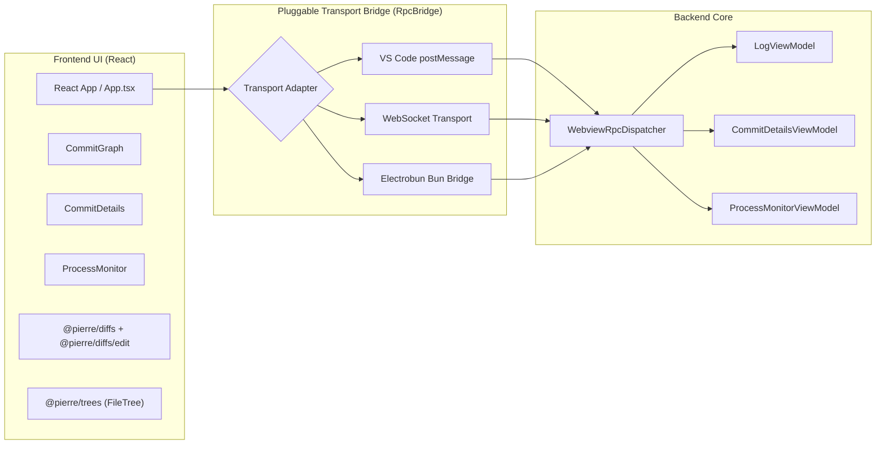
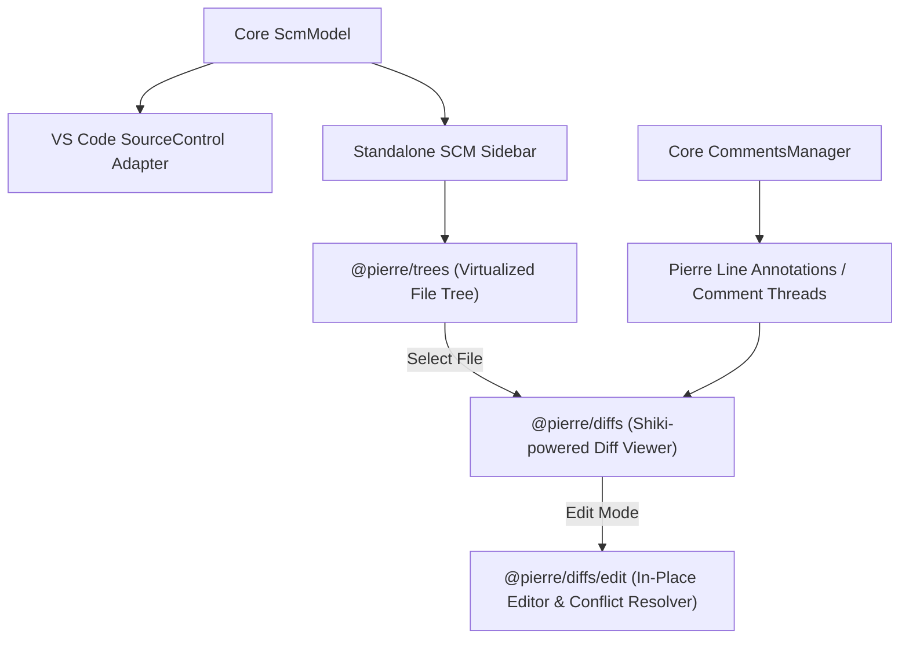
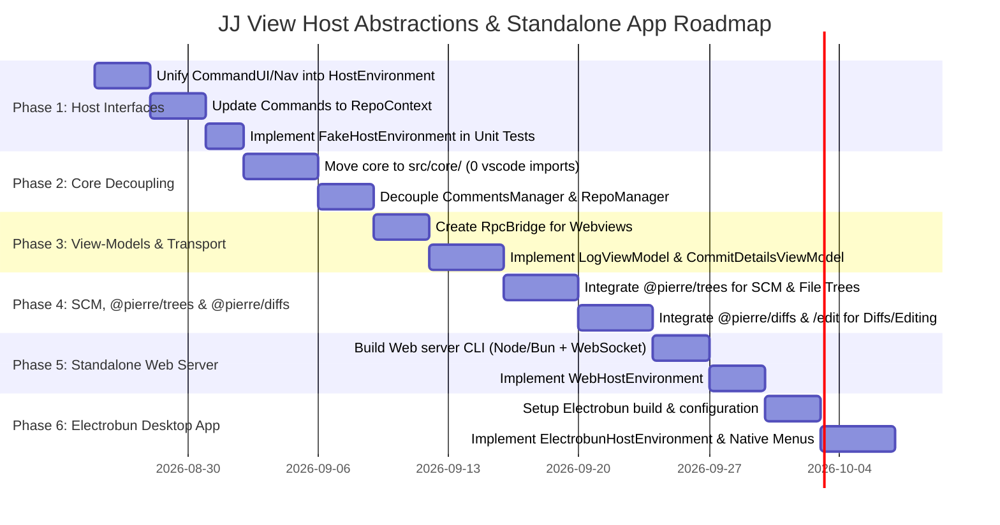

# Comprehensive Architecture Plan: Host Abstractions & Standalone JJ View (Web & Electrobun)

This document outlines the end-to-end plan to:
1. **Unify and generalize the host abstractions** across the codebase (rectifying the `Command*` naming mistake to create canonical, domain-agnostic `Host*` interfaces).
2. **Decouple core business logic** (`src/core/*`) completely from VS Code APIs.
3. **Abstract UI components and views** into standalone React view-models with a pluggable RPC/IPC bridge.
4. **Build a Standalone JJ View application** (Self-Hosted Website & Native Desktop App via Electrobun) utilizing:
   - **`@pierre/diffs`** for high-performance syntax-highlighted diff rendering and code review annotations.
   - **`@pierre/diffs/edit`** for in-place editing of mutable revisions, live working-copy changes, and conflict resolution.
   - **`@pierre/trees`** for virtualized file trees and SCM change navigation.

---

## Retrospective on Revisions `vu`, `qs`, and the Current State

### What `vu` and `qs` Prototyped
- **Revision `vu` (`vurxsnwr`)**: Introduced the first generic `HostEnvironment` contract (`HostUi`, `HostConfig`, `HostSecrets`, `HostNavigation`, `HostCommands`, `HostViews`, `HostDisposable`) in `src/common/host-environment.ts`, the `JjAppCore` engine in `src/app-core.ts`, `VsCodeHostEnvironment` in `src/host/vscode-host-environment.ts`, and `FakeHostEnvironment` in `src/test/fake-host-environment.ts`.
- **Revision `qs` (`qswsuktq`)**: Pushed the separation further into a full `src/core/` vs `src/vscode/` split. It added `HostAuth` (`getSession`), `HostStorage` (`get`, `update`), `setContextKey` in `HostCommands`, `HostDocuments`, and separated `LogViewModel` / `CommitDetailsViewModel` from VS Code webview panel management.

### The Command Interface Mistake & Current Architecture Gap
In recent work, we abstracted command implementations using interfaces in `src/common/command-context.ts`:
- `CommandUI` (e.g. `showInputBox`, `showQuickPick`, `showInformation`, `showWarning`, `showError`, `promptForRevision`, `withProgress`, `promptSelectOrCreate`)
- `CommandNavigation` (e.g. `openDiff`, `openMultiDiff`, `openMergeEditor`, `openFile`, `openFolder`, `openExternal`, `copyToClipboard`, `openSettings`, `closeTab`, `focusScmInput`)
- `CommandConfig` (e.g. `get<T>(key: string, defaultValue?: T)`)
- `HostDocuments` (e.g. `readLineRangeText`, `replaceLineRangeAndSave`, `saveIfDirty`, `getOpenDocumentText`)
- `CommandServices` (e.g. `commentsManager`)
- `CommandContext`

While this decoupled command handlers (`src/commands/*`) from direct `vscode` imports, **naming them `Command*` was overly specific**. In reality, these are universal capabilities required across the entire app—by Webviews, Code Forge services, Auth Managers, Process Trackers, SCM providers, and Background Tasks.

```mermaid
graph TD
    subgraph "Current Problematic State"
        CC[CommandContext] --> CUI[CommandUI]
        CC --> CNav[CommandNavigation]
        CC --> CCfg[CommandConfig]
        CC --> HDoc[HostDocuments]
        HE[HostEnvironment (from vu/qs)] -.->|Disjoint & Incomplete| CC
    end

    subgraph "Target Unified Architecture"
        HE2[HostEnvironment] --> HUI[HostUi]
        HE2 --> HNav[HostNavigation]
        HE2 --> HCfg[HostConfig]
        HE2 --> HDocs[HostDocuments]
        HE2 --> HSec[HostSecrets]
        HE2 --> HAuth[HostAuth]
        HE2 --> HStore[HostStorage]
        HE2 --> HCmd[HostCommands]
        HE2 --> HViews[HostViews]
        
        AC[AppContext / RepoContext] --> HE2
        AC --> CoreDomain[Core Engine: JjRepository, JjService, CodeForge, Comments, SCM]
    end
```

---

## Part 1: Host Abstractions Refactoring (Phased Plan)

### Phase 1: Unify & Elevate `Host*` Interfaces (Rectify Command Interfaces)

Consolidate all environment capabilities into canonical, reusable interfaces located in `src/core/host/host-environment.ts` (or `src/common/host-environment.ts`):

1. **`HostUi`**:
   - User interaction methods: `showInformation`, `showWarning`, `showError`, `showInputBox`, `showQuickPick`, `showMultiQuickPick`, `promptForRevision`, `promptSelectOrCreate`, `withProgress`, `setStatusBarMessage`.
   - Modals and toast notifications format.
2. **`HostNavigation`**:
   - Diffing & editing navigation: `openDiff(left, right, title)`, `openMultiDiff(title, resources)`, `openMergeEditor(resourceUri)`, `openFile(uri)`, `openFolder(folderUri, newWindow?)`, `openExternal(url)`, `copyToClipboard(text)`, `openSettings(settingId?)`, `closeTab(uri)`, `focusScmInput()`.
3. **`HostConfig`**:
   - Type-safe config access: `get<T>(key: string, defaultValue?: T): T`, `update<T>(key: string, value: T): Promise<void>`.
4. **`HostDocuments` / `HostEditor`**:
   - Workspace document manipulation: `readLineRangeText`, `replaceLineRangeAndSave`, `saveIfDirty`, `getOpenDocumentText`.
5. **`HostStorage`**:
   - Workspace-level and global key-value store persistence: `get<T>(key: string, defaultValue?: T): T`, `update(key: string, value: unknown): Promise<void>`.
6. **`HostSecrets`**:
   - Secure token storage for forge tokens: `get(key: string)`, `store(key: string, value: string)`, `delete(key: string)`.
7. **`HostAuth`**:
   - Platform authentication providers: `getSession(providerId, scopes, options)`.
8. **`HostCommands`**:
   - Command dispatch & context keys: `registerCommand(id, handler)`, `executeCommand(id, ...args)`, `setContextKey(key, value)`.
9. **`HostViews`**:
   - View registry: `registerWebviewProvider`, `registerEditorProvider`, `registerFileSystemProvider`, `registerDecorationProvider`.
10. **`AppContext` & `RepoContext`**:
    - `AppContext`: Global application state (`host: HostEnvironment`, `repositoryManager: JjRepositoryManager`, `codeForgeRegistry: CodeForgeRegistry`, `authManager: CodeForgeAuthManager`, `processTracker: JjProcessTracker`).
    - `RepoContext`: Repository-scoped execution context passed to commands, containing `{ repo: JjRepository; host: HostEnvironment; log: LoggerChannel; comments?: CommentsManager }` with convenience accessors `ui`, `nav`, `config`, `documents`.

#### Migration Steps for Phase 1:
- Replace `CommandContext` with `RepoContext` across all command signatures in `src/commands/*.ts`.
- Rename `VSCodeCommandContext` to `VSCodeRepoContext` and implement full `VSCodeHostEnvironment`.
- Update `FakeHostEnvironment` in `src/test/fake-host-environment.ts` and `FakeRepoContext`. Unit tests strictly use **real `TestRepo` on disk** and real `JjService` operations, while replacing `vi.mock('vscode')` with `FakeHostEnvironment`.

---

### Phase 2: Core Domain Logic Decoupling (`src/core/*`)

Ensure that domain logic has **strictly zero imports of `vscode`**:

```
src/
├── core/
│   ├── app-core.ts                   # Platform-agnostic application orchestrator
│   ├── change-detection-manager.ts   # File watcher & status polling engine
│   ├── code-forge-auth.ts            # Auth state manager using HostSecrets/HostAuth
│   ├── code-forge-provider.ts        # Base forge provider interface
│   ├── code-forge-registry.ts        # Forge registry
│   ├── code-forge-service.ts         # Forge service (PRs/MRs/Gerrit reviews)
│   ├── comments-manager.ts           # Pure domain comment threads model
│   ├── diff-tab-cleaner.ts           # Automated diff tab lifecycle logic
│   ├── directory-watcher.ts          # Filesystem watcher abstraction
│   ├── gerrit-provider.ts            # Gerrit HTTP/REST API provider
│   ├── github-provider.ts            # GitHub GraphQL/REST API provider
│   ├── gitlab-provider.ts            # GitLab API provider
│   ├── jj-context-keys.ts            # Context key constants
│   ├── jj-process-tracker.ts         # Diagnostic process execution tracker
│   ├── jj-repository-manager.ts      # Multi-repository discovery & focus manager
│   ├── jj-repository.ts              # Single repository operations & status
│   ├── jj-schemas.ts                 # JSON schemas for templates and commands
│   ├── jj-service.ts                 # Jujutsu CLI execution engine
│   ├── jj-template-builder.ts        # Revset and template query builders
│   ├── jj-types.ts                   # Core data models (commits, bookmarks, operations)
│   ├── patch-helper.ts               # Unified diff patch generation
│   ├── poller.ts                     # Interval polling utility
│   ├── scm-model.ts                  # SCM state model (statuses, modified/untracked files)
│   ├── uri-utils.ts                  # Portable URI helpers (wrapping vscode-uri)
│   ├── commands/                     # All pure command business logic
│   │   ├── abandon.ts
│   │   ├── commit.ts
│   │   ├── describe.ts
│   │   └── ...
│   ├── host/                         # Universal Host interfaces
│   │   └── host-environment.ts
│   └── models/                       # UI View-Models
│       ├── commit-details-model.ts
│       ├── log-view-model.ts
│       └── process-monitor-model.ts
```

#### Key Refactorings in Phase 2:
- **`EventEmitter` Isolation**: Replace `vscode.EventEmitter` in core with a zero-dependency lightweight typed event emitter (`TypedEventEmitter<T>`).
- **`CommentsManager` Decoupling**: Move `vscode.CommentController` and `vscode.CommentThread` into `src/vscode/providers/vscode-comments-provider.ts`. The core `CommentsManager` only handles review data models, remote syncing, and status queries.
- **`JjRepositoryManager`**: Replace `vscode.workspace.workspaceFolders` and `vscode.workspaceState` with `HostEnvironment.storage` and `HostConfig`.

---

### Phase 3: View-Models & Transport-Agnostic Webview Layer

The React webview frontend (`src/webview/`) currently imports VS Code runtime globals (`window.acquireVsCodeApi()`).



#### Refactoring Plan:
1. **Extract `RpcBridge` / `WebviewTransport`**:
   - `src/webview/transport/bridge.ts`: Provides a unified interface:
     - `sendMessage(type: string, payload: unknown): void`
     - `onMessage(handler: (event: MessageEvent) => void): Disposable`
     - `acquireInitialData(): InitialData`
2. **Implement View Models in `src/core/models/`**:
   - `LogViewModel`: Computes graph layouts (`renderdag-ts`), tracks commit selection sets, filters hidden actions, triggers rebase / squash / abandon / bookmark operations.
   - `CommitDetailsViewModel`: Manages commit metadata editing, diff queries, hunk staging/discarding, and description formatting.
   - `ProcessMonitorViewModel`: Streams live operation status, duration, cancel requests.
3. **Decouple React Components**:
   - Replace direct `vscode.postMessage` calls in `src/webview/App.tsx`, `CommitNode.tsx`, `Bookmark.tsx`, and `CommitDetails.tsx` with calls to `useBridge()`.

---

### Phase 4: SCM, Tree, and Editable Diffs with `@pierre/trees` & `@pierre/diffs` (inc. `@pierre/diffs/edit`)

VS Code has built-in SCM trees, QuickDiff, and file diffing. In standalone mode (Web and Electrobun), we will power source viewing, live diff editing, conflict resolution, and file trees using `@pierre/diffs`, `@pierre/diffs/edit`, and `@pierre/trees`.



#### Integration Plan:
1. **`@pierre/trees` for File Trees & SCM Sidebar**:
   - **Working Copy Changed Files**: Renders modified, added, deleted, and conflicted files with instant virtualization (handles repos with thousands of modified files effortlessly).
   - **Commit Details Changed Files**: Renders the changed file tree per selected commit.
   - **Revision File Explorer**: Browses the complete file tree at any historical revision (`jj-view.viewFileAtRevision`).
   - **Path-first Model**: Seamlessly handles hierarchical folder expansion, badges (staged, unstaged, conflict markers), and inline action buttons (discard hunk/file, stage, squash into parent).

2. **`@pierre/diffs` & `@pierre/diffs/edit` for Viewing & In-Place Editing**:
   - **Syntax-Highlighted Diffs**: Built on Shiki syntax highlighting, rendering both split (side-by-side) and stacked (unified) diffs.
   - **In-Place Editable Diffs (`@pierre/diffs/edit`)**:
     - Allows users to directly edit working copy files and mutable revisions inside the diff view.
     - Supports multi-cursor selection, find & replace, undo/redo stack, lint markers, and auto-save / dirty tracking.
     - Replaces the need for heavy editor dependencies like Monaco, dramatically reducing bundle size and memory usage while ensuring unified styling with Pierre components.
   - **Merge Conflict Resolution**:
     - Renders 3-way/2-way conflict diffs with direct in-place editing to resolve conflict markers, test resolutions, and mark conflicts resolved (`jj resolve`).
   - **Inline Code Review Comments**:
     - Maps `CommentsManager` threads directly to `@pierre/diffs` flexible annotation system, rendering rich GitHub/GitLab/Gerrit comment threads directly on the relevant diff lines with reply, resolve, and done actions.
   - **Multi-File Diffs**: Scrollable multi-file diff view for entire commits or arbitrary revision comparisons (`jj diff -r ...`).

---

### Phase 5: VS Code Adapter Layer Clean-Up (`src/vscode/*`)

Consolidate all VS Code specific code into `src/vscode/`:
- `src/vscode/extension.ts`: Main VS Code activation hook.
- `src/vscode/app.ts`: Bootstrap wiring between `JjAppCore` and `VSCodeHostEnvironment`.
- `src/vscode/host/`: Implementations of `HostUi`, `HostNavigation`, `HostConfig`, `HostDocuments`, `HostStorage`, `HostSecrets`, `HostAuth`, `HostCommands`, `HostViews`.
- `src/vscode/providers/`:
  - `vscode-log-webview-provider.ts`
  - `vscode-commit-details-editor-provider.ts`
  - `vscode-process-monitor-provider.ts`
  - `vscode-scm-provider.ts`
  - `vscode-comments-provider.ts`
  - `vscode-view-fs-provider.ts`
  - `vscode-edit-fs-provider.ts`
  - `vscode-merge-provider.ts`
- `src/vscode/register-commands.ts`: Maps VS Code commands and context menus to core command handlers.

---

## Part 2: Standalone Application Architecture (Web & Electrobun)

```mermaid
graph TB
    subgraph "Core Domain Layer (Platform Agnostic)"
        CoreEngine[JjAppCore Engine]
        CoreServices[JjService + JjRepositoryManager + CodeForge + Comments]
        CoreVM[LogViewModel + CommitDetailsViewModel + ScmModel]
        CoreEngine --> CoreServices
        CoreServices --> CoreVM
    end

    subgraph "Target 1: VS Code Extension"
        VSC_Ext[src/vscode/extension.ts]
        VSC_Host[VsCodeHostEnvironment]
        VSC_Views[VS Code SCM, WebviewPanels, Editors]
        VSC_Ext --> VSC_Host
        VSC_Host --> CoreEngine
    end

    subgraph "Target 2: Self-Hosted Web App (Browser + Server)"
        Web_Server[src/server/server.ts (Node/Bun)]
        Web_Host[WebHostEnvironment]
        Web_Client[React SPA (Browser)]
        Pierre_Components["@pierre/diffs (with edit) + @pierre/trees"]
        Web_Server --> Web_Host
        Web_Host --> CoreEngine
        Web_Client <-->|WebSocket / REST| Web_Server
        Web_Client --> Pierre_Components
    end

    subgraph "Target 3: Electrobun Native App (Desktop)"
        EB_Main[src/electrobun/main.ts (Bun Backend)]
        EB_Host[ElectrobunHostEnvironment]
        EB_Window[Electrobun Webview Window]
        EB_Native[Native Menus, Tray, Dialogs, Shortcuts]
        EB_Main --> EB_Host
        EB_Main --> EB_Native
        EB_Host --> CoreEngine
        EB_Window <-->|Bun RPC Bridge| EB_Main
        EB_Window --> Web_Client
    end
```

---

### Target A: Self-Hosted Web Application

The Self-Hosted Web Application enables running `jj-view` on a remote server, headless machine, container, or localhost via any browser:

#### Backend (`src/server/`):
- **Runtime**: Node.js (v22+) or Bun.
- **Server CLI**: `jj-view serve [--port 8080] [--host 0.0.0.0] [--repo /path/to/repo]`.
- **HTTP Server**: Serves the compiled React Single Page App assets.
- **WebSocket Server**: Powers the bidirectional `RpcBridge` connecting the client UI with `JjAppCore`.
- **REST Endpoints**:
  - `/api/file?path=...&rev=...`: Streams file content for diffing and viewing.
  - `/api/diff?from=...&to=...`: Returns file diffs for `@pierre/diffs`.
  - `/api/tree?rev=...`: Returns file tree hierarchy for `@pierre/trees`.

#### Frontend (`src/standalone/` / `src/web/`):
- **Main Viewport Layout**:
  - **Left Sidebar**: Working copy SCM and repository explorer powered by `@pierre/trees`.
  - **Center Top**: Interactive Commit Graph (`CommitGraph.tsx`) with real-time drag-and-drop rebasing, bookmarking, and branch management.
  - **Center Bottom / Right**: Diff Viewer, In-Place Editor, and Conflict Resolver powered by `@pierre/diffs` & `@pierre/diffs/edit` (split or stacked diffs, syntax highlighted via Shiki, inline code review comments from GitHub/GitLab/Gerrit).
  - **Commit Details Panel**: Editable commit description, author/committer metadata, and changed file list.
- **Command Palette & UI Overlays**:
  - Web command palette (Ctrl+Shift+P / Cmd+Shift+P) providing quick access to all JJ View commands (`new`, `commit`, `rebase`, `absorb`, `bookmark`, `workspace`, etc.).
  - Dialog popups for revision input (`promptForRevision`), bookmark selection (`promptSelectOrCreate`), and confirmation modals.

#### `WebHostEnvironment` Implementation:
- `HostUi`: Renders floating toast notifications, browser modal prompts, and web progress spinners.
- `HostNavigation`: Updates URL routes (`/diff/`, `/commit/:id`), switches `@pierre/diffs` tabs, and writes to `navigator.clipboard`.
- `HostConfig`: Reads/writes settings stored in `localStorage` or `~/.config/jj-view/config.json`.
- `HostStorage`: Uses `localStorage` or IndexedDB for UI session preferences.
- `HostSecrets`: Stored securely in OS keychain via server-side keytar or server environment.

---

### Target B: Electrobun Native Desktop Application

[Electrobun](https://electrobun.dev/) is an ultra-fast, modern alternative to Electron combining Bun, Zig native bindings, and platform WebViews (WebKit on macOS/Linux, WebView2 on Windows).

#### Why Electrobun for JJ View?
- **Ultra-small bundle size**: ~25-35MB compared to 150MB+ with Electron.
- **Blazing startup time**: Under 50ms cold start.
- **Memory footprint**: ~15-30MB RAM vs 200MB+ for Chromium.
- **Direct Bun Integration**: Direct native filesystem and process spawning (`Bun.spawn`) for supercharged `jj` CLI execution.

#### Structure for Electrobun (`src/electrobun/`):
```
src/electrobun/
├── main.ts                    # Electrobun Bun entry point (backend)
├── electrobun-host-env.ts     # ElectrobunHostEnvironment implementation
├── electrobun.config.ts       # Electrobun app configuration (windows, permissions, build)
└── native/
    ├── menu.ts                # Native application menu bar (File, Edit, JJ, View, Help)
    ├── tray.ts                # System tray icon for active background operations
    └── dialogs.ts             # Native OS file/folder pickers & alert boxes
```

#### Backend Integration (`src/electrobun/main.ts`):
- Initializes `JjAppCore` with `ElectrobunHostEnvironment`.
- Creates native window:
  ```typescript
  import { BrowserWindow } from 'electrobun/bun';
  
  const win = new BrowserWindow({
      title: 'JJ View',
      url: 'views://main/index.html',
      frame: { width: 1280, height: 800 },
  });
  ```
- Exposes `RpcBridge` directly over Electrobun's Bun bridge (`window.__electrobunBunBridge`).

#### `ElectrobunHostEnvironment` Implementation:
- `HostUi`: Uses Electrobun native dialogs (`win.showDialog`) or web overlays.
- `HostNavigation`: Manages multi-tab navigation, opens external links via default browser (`Bun.openInEditor` / `open`), and uses native clipboard APIs.
- `HostConfig`: Persists to local filesystem `~/.config/jj-view/config.json`.
- `HostCommands`: Maps native OS menu items and global keyboard shortcuts (e.g. `Cmd+N`, `Cmd+Enter` to commit, `Cmd+R` to refresh).

---

## Phased Implementation Roadmap



---

## Verification & Testing Plan

### Automated Tests
1. **Unit Tests (Vitest)**:
   - Run unit tests with `FakeHostEnvironment` and **real `TestRepo`** on disk ensuring 100% of command tests and domain tests run with **zero VS Code mocking** (`pnpm test:unit`).
2. **Integration Tests (VS Code Test Runner)**:
   - Run VS Code integration tests using real `TestRepo` instances on disk (`pnpm test:integration:all`).
3. **Web & Electrobun Component Tests (Vitest / Testing Library)**:
   - Test `@pierre/trees` SCM file lists and `@pierre/diffs` / `@pierre/diffs/edit` diff and in-place editing renders with fake repo data.
4. **Web & Electrobun E2E Tests (Playwright)**:
   - Automated browser testing verifying:
     - Log Graph rendering & drag-to-rebase interactions.
     - Commit details editing and staging.
     - `@pierre/diffs` side-by-side & unified viewing and comment annotations.
     - `@pierre/diffs/edit` in-place file modifications and conflict resolution.
     - `@pierre/trees` file selection and expansion.
     - Command palette execution.

### Manual Verification
1. **VS Code Extension**: Verify all menus, context menus, SCM tree, custom commit editor, log graph, and comments work seamlessly in VS Code.
2. **Web Server (`jj-view serve`)**: Launch web server against a live test repository, open `http://localhost:8080` in Chrome/Firefox/Safari, and verify all graph operations, `@pierre/trees` sidebar, and `@pierre/diffs` / `@pierre/diffs/edit` viewer.
3. **Electrobun Desktop App**: Build desktop binary (`pnpm build:electrobun`), launch app on macOS/Linux, verify native window behavior, menus, keyboard shortcuts, and performance.
